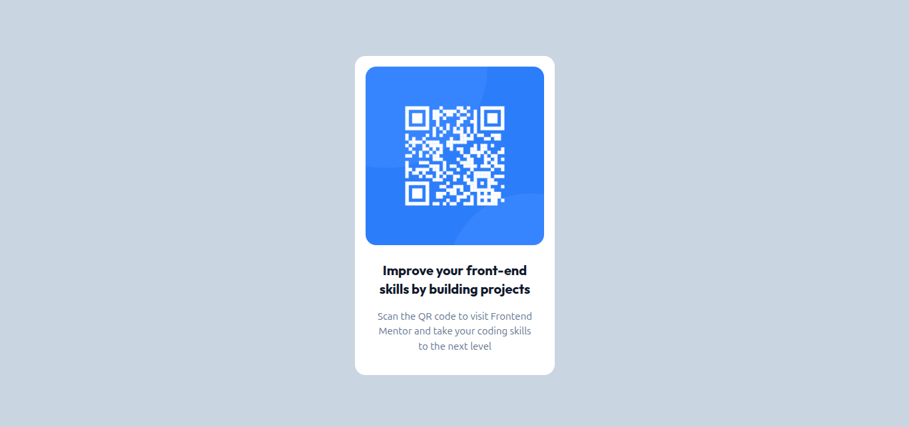

# Frontend Mentor - QR code component solution

This is a solution to the [QR code component challenge on Frontend Mentor](https://www.frontendmentor.io/challenges/qr-code-component-iux_sIO_H). Frontend Mentor challenges help you improve your coding skills by building realistic projects.

## Table of contents

- [Overview](#overview)
  - [Screenshot](#screenshot)
  - [Links](#links)
- [My process](#my-process)
  - [Built with](#built-with)
  - [What I learned](#what-i-learned)
  - [Continued development](#continued-development)
- [Author](#author)

## Overview

### Screenshot

### Links

- Solution URL: [My github repo](https://github.com/frontend-rustyff12/01-fm-qr-component)

- Live Site URL: [Netlify live site](https://qr-code-component-rustyff12.netlify.app/)

## My process

### Built with

- Semantic HTML5 markup
- Tailwind CSS
- Flexbox

### What I learned

I am using these projects to practice using tailwind. I had not used it in awhile so it was good to learn about the new ways in which is is set up in the project.

### Continued development

It is a beginner project, so probably not much continued development

## Author

- Frontend Mentor - [@rustyff12](https://www.frontendmentor.io/profile/rustyff12)
